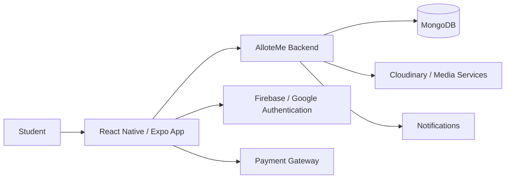
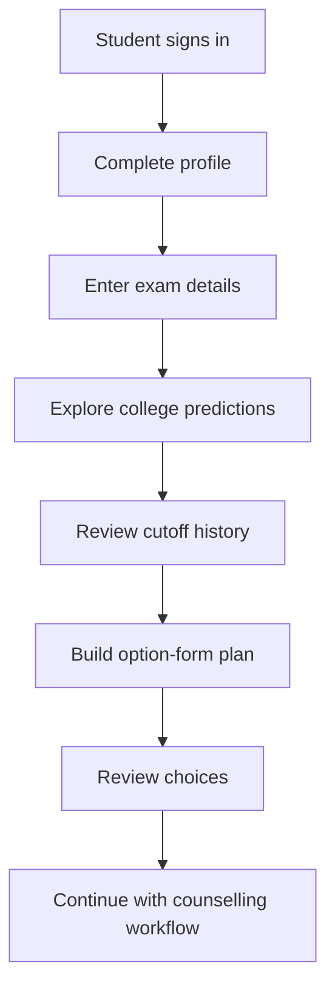

# AlloteMe Android

AlloteMe is the mobile side of an admission-counselling platform built to help students make better college choices for MHTCET, JEE and NEET.

The app brings prediction, cutoff information, option-form planning and student workflows into a single mobile experience instead of making students manage the process across many unrelated sources.

## Core experience

- College prediction and cutoff analysis
- Option-form planning
- Student authentication
- Google sign-in
- Push notifications
- Document and media handling
- Payment integration
- Charts and data-driven views
- Responsive web support through Expo
- Real-time features through Socket.IO / Yjs where required

## Architecture



## Typical student journey



## Tech stack

- React Native
- Expo
- React Navigation
- Node.js / Express backend
- MongoDB
- Firebase / Google Sign-In
- Axios
- Socket.IO
- Razorpay
- AsyncStorage
- Expo Notifications
- React Native Reanimated
- React Native SVG and charting libraries

## Run locally

Install dependencies:

```bash
npm install
```

Start Expo:

```bash
npm start
```

For Android:

```bash
npm run android
```

For web:

```bash
npm run web
```

The project requires the relevant authentication, API, payment and notification environment configuration before all features can be used.

## Why I built it

Admission counselling is stressful because students have to make important choices from a large amount of information. I wanted the app to feel less like a collection of cutoff tables and more like a guided decision-making tool.

## Related project

Backend and supporting services are maintained separately in the AlloteMe project.
